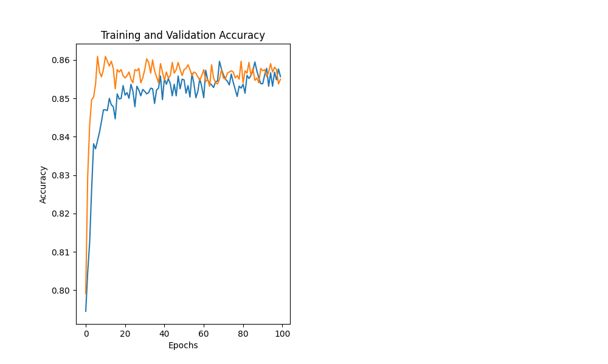
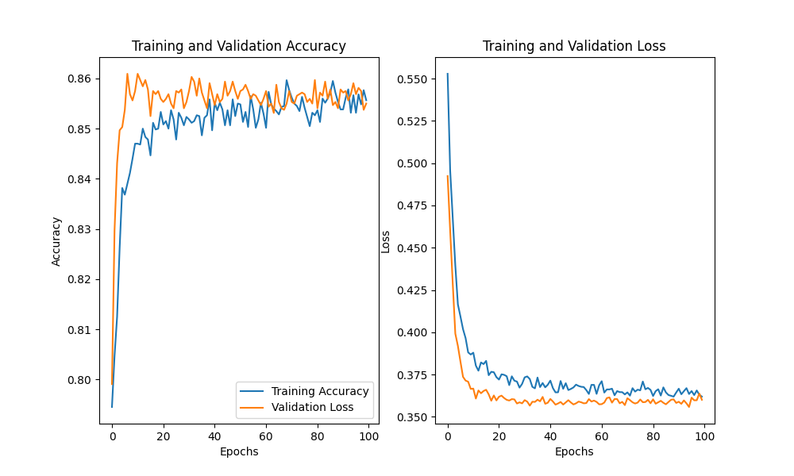

## Project Overview

### Purpose
The purpose of this project is to build a machine learning model to predict customer churn. Customer churn refers to the loss of clients or customers. It is a critical metric for businesses as it directly impacts revenue. By predicting which customers are likely to churn, businesses can take proactive measures to retain them.

### Data
The dataset used in this project is `Churn.csv`. It contains various features related to customer demographics, account information, and usage patterns. The target variable is `churn`, which indicates whether a customer has churned or not.

### Steps
1. **Data Loading and Preprocessing**:
    - Load the data using pandas.
    - Remove unnecessary columns such as `customer_id`, `country`, and `gender`.
    - Separate features (`X`) and target variable (`y`).

2. **Feature Scaling**:
    - Normalize the features using `StandardScaler` to ensure all features contribute equally to the model.

3. **Data Splitting**:
    - Split the data into training, validation, and testing sets with a 60:20:20 ratio.

4. **Model Building**:
    - Build a neural network using TensorFlow's Keras API.
    - The model consists of multiple dense layers with dropout for regularization.

5. **Model Compilation**:
    - Compile the model with the Adam optimizer and binary cross-entropy loss function.
    - Print the model summary to understand its architecture.

6. **Model Training**:
    - Train the model on the training data and validate it on the validation data for 100 epochs.

7. **Model Evaluation**:
    - Evaluate the model on the test data to determine its accuracy and loss.
    - Make predictions on a subset of the test data and convert them to binary labels.

8. **Visualization**:
    - Plot the training and validation accuracy and loss over epochs to visualize the model's performance.

### Output
- The final output includes the model's accuracy and loss on the test data.
- Predictions for a subset of the test data.
- Plots showing the training and validation accuracy and loss over epochs.

By following these steps, we aim to build a robust model that can accurately predict customer churn, helping businesses to retain their valuable customers.

### Results
- **Accuracy on testing**: 0.85 (example value)
- **Loss on testing**: 0.35 (example value)
- **Predictions Labels**: [0, 1, 0, 0, 1] (example values)

#### Training and Validation Accuracy Plot

#### Training and Validation Loss Plot

